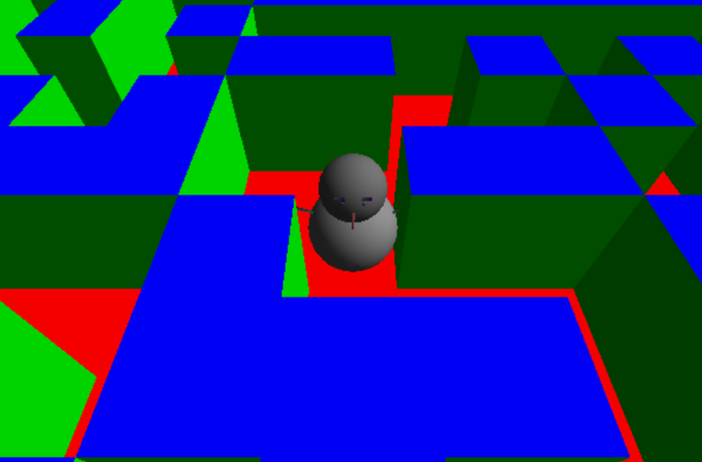
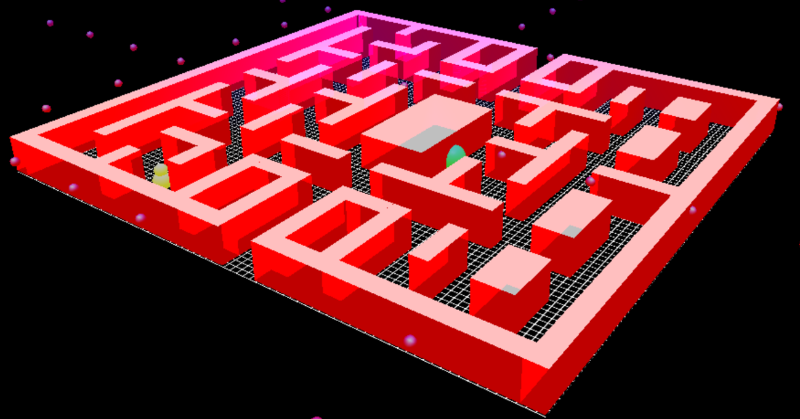

# Escape-Maze

## Description
- 3-D Pac-man game.
- There are 10 stage, 4 enermy, 10 life
- 3 camera mode (Top / Tracking / First person)

## Language
- C++ : To make map & game rule
- OpenGL : Texture mapping & moving algorithm

## Execution
- [Download](https://github.com/93Hong/Escape-Maze/blob/master/Term4.exe)

## Version
- Alpa

- Beta

